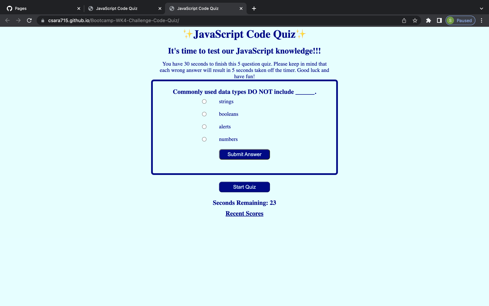

# Week 4 Challenge: Code Quiz

## User Story

```
AS A coding boot camp student
I WANT to take a timed quiz on JavaScript fundamentals that stores recent scores
SO THAT I can gauge my progress compared to my peers
```

## Acceptance Criteria

```
GIVEN I am taking a code quiz
WHEN I click the start button
THEN I am presented with a list of high scores for the quiz
THEN a timer starts with 60 seconds and I am presented with a question
WHEN I answer a question
THEN I receive a message on whether I answered correctly
THEN I am presented with another question
WHEN I answer a question incorrectly
THEN five seconds of time is subtracted from the clock
WHEN all questions are answered or the timer reaches 0
THEN the quiz is over
WHEN the quiz is over
THEN I can save my initials and my score
When I click the start button again
THEN the quiz will allow me to try again
```

## Mock-Up



- https://csara715.github.io/Bootcamp-WK4-Challenge/

---

© 2022 Trilogy Education Services, LLC, a 2U, Inc. brand. Confidential and Proprietary. All Rights Reserved.
